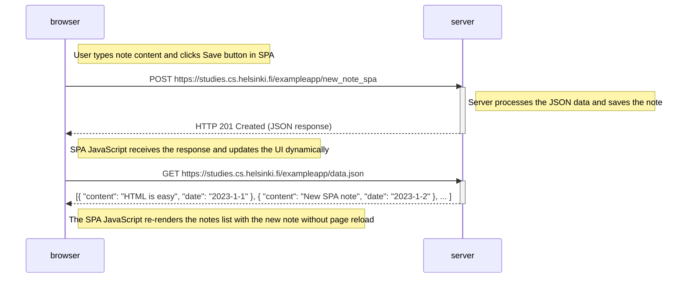

# Exercise 0.6: New note in Single page app diagram

This diagram shows the sequence of events when a user creates a new note using the single-page version of the app.

```mermaid
sequenceDiagram
    participant browser
    participant server

    Note right of browser: User types note content and clicks Save button in SPA

    browser->>server: POST https://studies.cs.helsinki.fi/exampleapp/new_note_spa
    activate server
    Note right of server: Server processes the JSON data and saves the note
    server-->>browser: HTTP 201 Created (JSON response)
    deactivate server

    Note right of browser: SPA JavaScript receives the response and updates the UI dynamically

    browser->>server: GET https://studies.cs.helsinki.fi/exampleapp/data.json
    activate server
    server-->>browser: [{ "content": "HTML is easy", "date": "2023-1-1" }, { "content": "New SPA note", "date": "2023-1-2" }, ... ]
    deactivate server

    Note right of browser: The SPA JavaScript re-renders the notes list with the new note without page reload
```